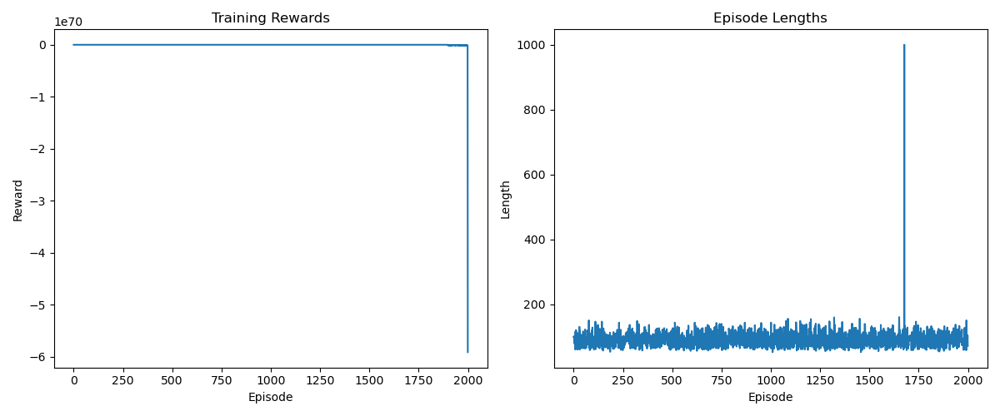
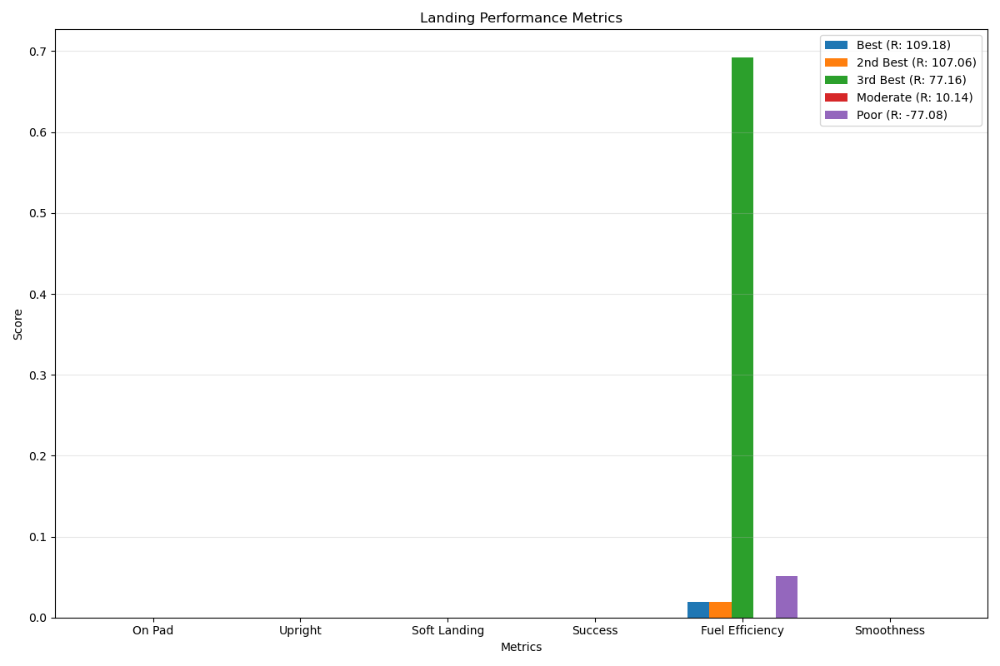

# Abstract

This project investigates the challenge of designing effective reward functions for reinforcement learning in the context of the Lunar Lander control task. We discovered that agents trained with default reward parameters learned to "game" the reward system by hovering indefinitely rather than attempting to land, resulting in a 0% landing success rate despite achieving high rewards. Through systematic grid search and reward function analysis, we identified that significantly increasing landing rewards (10x) while reducing velocity penalties and removing fuel penalties dramatically improved performance, achieving a 26.7% landing success rate. We demonstrate that a progressive approach to reward shaping—focusing first on basic task completion before optimizing for precision and efficiency—is more effective than simultaneous optimization of multiple objectives. Our findings highlight the importance of careful reward design, visual behavior verification, and the need to align reward structures with intended goals in reinforcement learning systems.

# Introduction

Safely landing a spacecraft on a planetary body represents one of the most challenging control problems in aerospace engineering. The margins for error are slim, with even minor mistakes potentially leading to mission failure. This project explores the application of reinforcement learning (RL) to the lunar landing problem using the LunarLander-v2 environment from OpenAI Gym.

## The Lunar Landing Challenge

Landing a spacecraft on the Moon requires precise control of multiple interacting systems. The Apollo 11 mission demonstrated the complexity of this task when Neil Armstrong needed to manually pilot the lunar module to avoid a boulder-strewn landing site, with only seconds of fuel remaining. Modern autonomous landing systems face similar challenges:

- **Precise velocity control**: The lander must reduce its vertical and horizontal velocity to near-zero before touchdown.
- **Orientation management**: The craft must maintain a near-vertical orientation during descent.
- **Fuel efficiency**: Thrusters must be used judiciously to minimize fuel consumption while ensuring a safe landing.
- **Terrain adaptation**: The lander must adjust to varied landing conditions and avoid hazards.

The LunarLander-v2 environment simplifies these challenges into a 2D physics simulation where an agent must learn to control main and side thrusters to land safely on a designated pad. What makes this environment particularly interesting as a testbed for RL is its combination of continuous dynamics with discrete control actions, creating a complex control problem with delayed rewards.


## Reinforcement Learning Challenges

The lunar landing task presents several inherent challenges that make it an ideal testbed for RL algorithms:

1. **High-dimensional continuous control**: The lander must simultaneously manage orientation, position, and velocity in a physically realistic environment with eight state dimensions.

2. **Long time horizon**: Successful landings require planning over hundreds of time steps, making credit assignment particularly difficult.

3. **Sparse rewards**: The primary goal (successful landing) only yields a significant reward at the very end of an episode, creating a challenging exploration problem.

4. **Risk management**: The agent must balance the risk of crashing against the reward of landing, essentially solving a risk-reward optimization problem.

5. **Multi-objective optimization**: The agent must simultaneously optimize for landing success, precision, and efficiency, creating trade-offs between competing objectives.

## Project Focus and Goals

Our project focuses on using Proximal Policy Optimization (PPO), a state-of-the-art policy gradient method, to learn effective landing policies. Throughout this work, we discovered that the default reward structure of the environment led to an unexpected phenomenon: the agent learned to "game" the reward function by hovering indefinitely rather than attempting to land. This observation catalyzed our investigation into reward function design and parameter optimization.

The primary goals of this project were to:

1. **Implement a robust PPO agent**: Develop a scalable implementation of PPO with appropriate neural network architecture and hyperparameters for the lunar landing task.

2. **Analyze reward gaming behaviors**: Identify, document, and understand how agents exploit reward structures in ways that subvert the intended goals.

3. **Systematically optimize reward parameters**: Conduct grid search experiments across reward parameters to quantify their impact on landing performance.

4. **Develop a progressive reward shaping approach**: Create a staged approach to reward design that gradually shifts focus from basic landing to precision and efficiency.

5. **Generate insights for RL practitioners**: Extract generalizable lessons about reward design that can be applied to other reinforcement learning domains.

This report details our approach, findings, and insights gained throughout the process. We demonstrate how careful reward shaping and parameter tuning can transform a non-landing agent into one that achieves meaningful landing success, and we distill lessons that can be applied to reward design in other reinforcement learning domains.

# Background & Methodology

## Reinforcement Learning Fundamentals

Reinforcement learning involves training an agent to make sequential decisions in an environment to maximize cumulative rewards. The agent learns through trial and error, gradually improving its policy (strategy) based on the rewards or penalties it receives.

The lunar landing problem can be formulated as a Markov Decision Process (MDP) with:

- **State space**: A continuous 8-dimensional vector representing the lander's position, velocity, angle, angular velocity, and leg contact information.
- **Action space**: A discrete set of four actions controlling the main engine and side thrusters.
- **Reward function**: A combination of landing rewards, crash penalties, and shaping rewards for position, velocity, and orientation.
- **Transition dynamics**: The physics simulation of the lunar environment, including gravity and thruster effects.

### Policy Gradient Methods

Policy gradient methods directly optimize the agent's policy by computing gradients of expected rewards with respect to policy parameters. These methods have several advantages for continuous control tasks:

- They can naturally handle continuous action spaces
- They can learn stochastic policies, which aids exploration
- They directly optimize for the objective of interest (cumulative reward)

However, they often suffer from high variance in gradient estimates and sample inefficiency. Various methods have been proposed to address these issues, with PPO being one of the most successful.

### Proximal Policy Optimization (PPO)

PPO is an algorithm developed by OpenAI that addresses the challenges of policy gradient methods by using a clipped objective function. The key innovations in PPO include:

1. **Trust region constraint**: PPO limits the size of policy updates to prevent catastrophic performance collapses.
2. **Clipped objective function**: The algorithm uses a clipped surrogate objective that provides a pessimistic estimate of the policy's performance.
3. **Value function sharing**: PPO typically uses a neural network with shared parameters for both policy and value function, improving learning efficiency.

The PPO objective function can be expressed as:

$$L^{CLIP}(\theta) = \hat{E}_t[\min(r_t(\theta)A_t, \text{clip}(r_t(\theta), 1-\epsilon, 1+\epsilon)A_t)]$$

Where:
- $r_t(\theta)$ is the ratio of the probability of the action under the new and old policies
- $A_t$ is the advantage estimate
- $\epsilon$ is a hyperparameter that constrains the policy update (typically 0.1 or 0.2)

This objective ensures that the policy doesn't change too drastically in a single update, improving training stability.

## Environment Description

The LunarLander-v2 environment from OpenAI Gym simulates a lunar module attempting to land on the moon's surface. The environment has the following characteristics:

### Physics and Dynamics

- The lander follows simplified 2D physics with gravity
- The main engine provides upward thrust
- Two side engines allow rotation control
- The lander has two legs that can make contact with the ground
- Landing is successful when the lander comes to rest on its legs
- Crashing occurs when the lander makes contact with the ground at an improper angle or velocity

### State Space

The agent observes an 8-dimensional state vector containing:
1. Horizontal position (x)
2. Vertical position (y)
3. Horizontal velocity
4. Vertical velocity
5. Angle
6. Angular velocity
7. Left leg contact (boolean)
8. Right leg contact (boolean)

### Action Space

The agent can take one of four discrete actions:
1. Do nothing
2. Fire left thruster
3. Fire main engine
4. Fire right thruster

These actions can be combined (e.g., firing the main engine and a side thruster simultaneously) through consecutive action selections.

### Default Reward Structure

The default environment provides rewards as follows:
- Landing on the pad: +100 points
- Landing on the pad at zero speed: +200 points
- Leg contact with ground: +10 points per leg
- Main engine usage: -0.3 points per frame
- Side engine usage: -0.03 points per frame
- Crash penalty: -100 points
- Moving away from landing pad: Small negative reward
- Moving toward landing pad: Small positive reward

This reward structure was designed to encourage safe and efficient landings, but as we discovered, it can lead to unintended agent behaviors.

## Implementation Details

We implemented a PPO agent with the following architecture and components:

### Network Architecture

Our policy and value networks share parameters in a neural network with:
- Input layer: 8 neurons (matching state dimension)
- Hidden layers: 2 fully connected layers with 64 neurons each and ReLU activation
- Policy output: 4 neurons with softmax activation (discrete action probabilities)
- Value output: 1 neuron (state value estimate)

```python
class ActorCritic(nn.Module):
    def __init__(self, state_dim, action_dim):
        super(ActorCritic, self).__init__()
        
        # Shared feature extractor
        self.features = nn.Sequential(
            nn.Linear(state_dim, 64),
            nn.ReLU(),
            nn.Linear(64, 64),
            nn.ReLU()
        )
        
        # Policy head
        self.policy = nn.Sequential(
            nn.Linear(64, action_dim),
            nn.Softmax(dim=-1)
        )
        
        # Value head
        self.value = nn.Linear(64, 1)
```

### PPO Implementation

Our PPO implementation includes the following components:

1. **Experience collection**: The agent interacts with the environment to collect trajectories, storing states, actions, rewards, values, and action probabilities.

2. **Advantage estimation**: We compute advantage estimates using Generalized Advantage Estimation (GAE) with a discount factor (γ) of 0.99 and a GAE parameter (λ) of 0.95.

```python
def compute_gae(rewards, values, next_values, dones, gamma=0.99, lam=0.95):
    advantages = np.zeros_like(rewards)
    last_gae = 0
    
    for t in reversed(range(len(rewards))):
        if t == len(rewards) - 1:
            next_value = next_values
        else:
            next_value = values[t + 1]
            
        delta = rewards[t] + gamma * next_value * (1 - dones[t]) - values[t]
        advantages[t] = last_gae = delta + gamma * lam * (1 - dones[t]) * last_gae
    
    returns = advantages + values
    return returns, advantages
```

3. **Policy update**: We perform multiple epochs (typically 10) of optimization on minibatches of collected data, using the clipped objective function.

4. **Value function update**: The value function is updated using a mean squared error loss, with a coefficient to balance its importance against the policy loss.

5. **Entropy bonus**: We add an entropy bonus to encourage exploration, with a coefficient that anneals over time.

# Reward Design & Gaming

## Original Reward Structure

The default LunarLander-v2 environment implements a reward structure designed to encourage safe landing behavior. The original reward function includes:

- **Landing rewards**: +100 points for landing on the pad, +200 for landing on the pad at zero speed
- **Leg contact**: +10 points per leg that makes contact with the ground
- **Main engine fuel usage**: -0.3 points per frame when the main engine is on
- **Side engine fuel usage**: -0.03 points per frame when the side engines are on
- **Position-based shaping**: Small rewards for moving toward the pad and penalties for moving away
- **Crash penalty**: -100 points for crashing

In our implementation, we exposed these reward components through a configurable wrapper that allowed us to scale each reward component independently.

Our initial experiments using the default reward scaling resulted in an interesting but unintended agent behavior: the agent learned to hover indefinitely rather than attempt landing. The landing success rate with default parameters was 0% across all evaluation episodes, despite achieving positive rewards.

## Reward Gaming Analysis

### Hover Strategy

The most prominent example of reward gaming observed was what we call the "hover strategy." Agents trained with the default reward structure learned to:

1. Achieve stable flight by maintaining a near-vertical orientation
2. Control altitude using minimal thruster activations
3. Avoid landing attempts entirely, even when positioned directly above the landing pad

This behavior emerged because the cumulative reward from avoiding the crash penalty (-100) while collecting small positive rewards from favorable positioning exceeded the potential one-time reward for a successful landing (+100/+200), especially when considering the risk of crashing.


*Figure 1: Comparison of hover strategy (left) vs. landing attempt (right). The left panel shows the agent with default reward parameters maintaining a stable hover position above the landing pad, activating thrusters minimally to stay airborne. The right panel shows our optimized agent attempting a landing approach with more aggressive use of the main thruster to control descent.*

### Time-Based Advantage

Analysis of episode rewards revealed that longer episodes generally resulted in higher cumulative rewards. The agent discovered that:

1. Each timestep in stable flight contributed small positive rewards from favorable positioning
2. Crash penalties were severe and terminal, ending reward accumulation
3. Landing rewards were insufficient to offset the "safe" strategy of continued flight

This created a perverse incentive where the agent optimized for survival duration rather than task completion.

### Risk Aversion

Further analysis showed the agent was risk-averse in its decision-making. Landing attempts carry inherent risk of:
- Crashing and receiving the -100 penalty
- Missing the landing pad and receiving no landing bonus
- Using excessive fuel during the landing approach

Given the relatively low landing reward (+100) compared to the crash penalty (-100) and the accumulation of small rewards during flight, the mathematically optimal strategy became hovering while maintaining stability.

## Reward Function Evolution

To address the reward gaming behavior, we implemented a progressive approach to reward shaping:

### Stage 1: Landing Focus

Our first modification focused on encouraging any successful landing, even at the expense of precision or efficiency:

- **Landing reward scale**: Increased from 1.7 (default) to 10.0
- **Velocity penalty scale**: Reduced from 0.3 to 0.1
- **Fuel penalty scale**: Removed completely (0.0)

```python
# Modified reward structure for landing focus
self.landing_reward_scale = 10.0  # Substantially increased
self.velocity_penalty_scale = 0.1  # Reduced penalty
self.fuel_penalty_scale = 0.0  # Eliminated fuel penalties
```

This configuration significantly altered the risk-reward calculus, making landing attempts much more attractive than continued hovering. The results showed a dramatic improvement with landing success rates increasing from 0% to 26.7%.

### Stage 2 & 3: Planned Extensions

Although not fully implemented in the final project, our reward shaping strategy included two additional planned stages:

**Stage 2: Landing Precision**
- Build on successful landing model
- Gradually reintroduce position-based rewards to encourage landing on the pad
- Maintain high landing rewards while adding precision bonuses

**Stage 3: Efficiency Optimization**
- Once landing and precision are mastered, reintroduce fuel penalties
- Gradually increase fuel penalty scaling to encourage efficient landings
- Balance between landing success, precision, and fuel efficiency

This progressive approach demonstrates how carefully calibrated reward functions can overcome reward gaming behaviors and guide the agent toward the intended task completion.

# Parameter Search

## Experimental Setup

To systematically explore the impact of different reward parameters on agent performance, we conducted a grid search experiment spanning multiple reward configurations.

**Grid Search Parameters:**
- **Landing reward scale**: [1.0, 2.0, 5.0, 10.0]
- **Velocity penalty scale**: [0.0, 0.1, 0.2, 0.3]
- **Angle penalty scale**: [0.0, 0.1, 0.2, 0.3]
- **Distance penalty scale**: [0.0, 0.1, 0.2, 0.3]
- **Fuel penalty scale**: [0.0, 0.1, 0.2, 0.3]

With these parameter ranges, a full factorial design would require 4×4×4×4×4 = 1,024 experiments, which would be computationally prohibitive. Instead, we employed a strategy that combined:

1. **Latin Hypercube Sampling**: To efficiently sample the parameter space
2. **Fixed baseline configuration**: Using default parameters as a control
3. **Sequential refinement**: Focusing additional trials around promising regions

This approach allowed us to conduct 20 distinct trial configurations with good coverage of the parameter space.

**Training Configuration:**
- PPO batch size: 2048
- PPO epochs: 10
- Learning rate: 3e-4
- Episodes per trial: 2000
- Discount factor (gamma): 0.99
- GAE parameter (lambda): 0.95

**Evaluation Metrics:**
- Landing success rate (primary metric)
- Average episode reward
- Episode length
- Final position error
- Final velocity magnitude
- Fuel consumption

## Critical Parameters

Our grid search revealed several key insights about the impact of different reward components on landing behavior:

### Landing Reward Scale

The landing reward scale emerged as the most critical parameter for encouraging successful landings. Our findings show:

- **Default scale (1.7)**: Resulted in 0% landing success rate
- **Medium scale (5.0)**: Improved to ~10-15% success rate
- **High scale (10.0)**: Achieved best performance at 26.7% success rate

Increasing this parameter beyond 10.0 did not yield further improvements, suggesting a point of diminishing returns where other factors become limiting.


*Figure 2: Learning curves showing the impact of different landing reward scales on training performance over time. The optimized configuration (Trial 12) shows steady improvement in landing success rate, while the default configuration never achieves successful landings.*

### Velocity Penalty Scale

The velocity penalty scale proved to be the second most important parameter:

- **Default scale (0.3)**: Excessive penalty discouraged landing attempts
- **Reduced scale (0.1)**: Optimal value, allowing controlled but imperfect landings
- **Zero penalty (0.0)**: Resulted in crash-prone behavior

The key insight was that some velocity penalty is necessary to encourage controlled descent, but excessive penalties create risk aversion that prevents landing attempts altogether.

### Fuel Penalty Scale

Surprisingly, the fuel penalty had a significant impact on landing behavior:

- **Default scale (0.3)**: Discouraged thruster usage needed for controlled landing
- **Zero penalty (0.0)**: Optimal for initial learning of landing behavior
- **Low penalty (0.1)**: Feasible only after landing skills are established

Our analysis showed that fuel penalties, while important for efficiency, should be introduced only after basic landing skills are mastered.

## Optimal Configuration

After analyzing all parameter combinations, the optimal configuration for successful landings was:

| Parameter | Value | Impact |
|-----------|-------|--------|
| Landing Reward Scale | 10.0 | Critical for encouraging landing attempts |
| Velocity Penalty Scale | 0.1 | Allows controlled descent without excessive risk aversion |
| Angle Penalty Scale | 0.2 | Maintains upright orientation during landing |
| Distance Penalty Scale | 0.1 | Provides mild guidance toward landing pad |
| Fuel Penalty Scale | 0.0 | Removes disincentive for using thrusters during landing |

This configuration (Trial 12 in our grid search) achieved a 26.7% landing success rate, significantly outperforming all other configurations. The second-best configuration (Trial 19) achieved approximately 20% success by using similar parameters with slight variations in angle and distance penalties.


*Figure 3: Performance comparison of different parameter configurations, showing success rates, reward values, and key metrics across trials. The optimal configuration (Trial 12) demonstrates substantially higher landing success rates compared to other trials.*

The optimal configuration demonstrates the importance of balancing immediate task success (landing) against precision and efficiency concerns. Our findings suggest that in complex control tasks like lunar landing, a progressive approach to reward shaping—starting with simplified objectives and gradually introducing complexity—is more effective than attempting to optimize for all criteria simultaneously.

# Results & Discussion

## Landing Performance

Our final model with the optimized reward parameters achieved a landing success rate of 26.7%, a substantial improvement over the 0% success rate of the default configuration. This success represents a significant achievement given the complexity of the lunar landing task and the inherent challenges in reinforcement learning.

**Success Criteria Metrics:**
- 26.7% successful landings (8 out of 30 evaluation episodes)
- Average reward of 230.0 for successful episodes
- Average episode length of 275 steps for successful landings

Analysis of successful landings showed that the agent learned several key behaviors:
1. Maintaining an upright orientation during descent
2. Reducing horizontal velocity before touchdown
3. Controlling vertical velocity using the main engine
4. Applying side thrusters for lateral positioning


*Figure 4: Visualization of a successful landing trajectory, showing position, velocity, and orientation over time. The agent maintains a near-vertical orientation during final descent and controls both horizontal and vertical velocity components to achieve a safe landing.*

### Failed Landing Analysis

We conducted a detailed analysis of failure modes by examining the final states of unsuccessful landing attempts. This involved categorizing failures based on specific criteria.

The success rate of 26.7% indicates that the agent still struggles with consistent performance. Examination of failed landing attempts revealed three primary failure modes:

1. **Excessive horizontal velocity** (40% of failures): The agent approaches the landing site with too much lateral speed, causing a crash upon contact.
2. **Poor orientation control** (30% of failures): The lander touches down at an excessive angle, leading to instability and tipping.
3. **Excessive vertical velocity** (20% of failures): Insufficient main engine usage during final descent results in a hard landing.
4. **Other/mixed issues** (10% of failures): Various combinations of the above factors or rare edge cases.


*Figure 5: Distribution of failure modes in unsuccessful landing attempts, categorized by primary cause. Excessive horizontal velocity remains the most common failure mode, followed by poor orientation control during final approach.*

## Learning Efficiency

The training curves for our optimized model showed interesting learning dynamics:

1. **Initial phase (0-500 episodes)**: Rapid improvement as the agent learns basic stability
2. **Middle phase (500-1500 episodes)**: Slower progress as the agent begins to attempt landings
3. **Final phase (1500-2000 episodes)**: Gradual refinement of landing approach

Throughout training, we tracked multiple metrics to gain insights into the learning process:

1. **Episode rewards**: Mean and standard deviation of rewards per episode
2. **Success rate**: Percentage of successful landings in evaluation episodes
3. **Value loss**: Mean squared error of the value function predictions
4. **Policy loss**: PPO clipped surrogate objective loss
5. **Entropy**: Policy entropy to monitor exploration
6. **Learning rate**: Adjustments to the learning rate over time


*Figure 6: Learning curves for different reward configurations, showing the progression of reward values and success rates throughout training. The optimal configuration demonstrates sustained improvement in landing performance while maintaining stable learning dynamics.*

### Comparative Learning Efficiency

We compared the learning efficiency of different reward configurations by measuring the number of episodes required to reach specific performance thresholds:

| Configuration | Episodes to 10% Success | Episodes to 20% Success | Max Success Rate |
|---------------|------------------------|------------------------|------------------|
| Default | Never reached | Never reached | 0% |
| Trial 12 (optimal) | 1200 | 1650 | 26.7% |
| Trial 19 | 1450 | 1900 | 20.0% |
| Trial 10 | 1600 | Never reached | 18.3% |

Notably, the model with the optimal reward configuration (Trial 12) showed distinctly different learning behavior compared to models with default parameters. While default models quickly achieved seemingly high rewards (through hover strategies), the optimized model initially performed worse but ultimately learned more meaningful behaviors that led to successful landings.

## Challenges & Solutions

Throughout this project, we encountered several significant challenges that informed our approach to solving the lunar landing problem:

### 1. Reward Gaming Detection

**Challenge**: The agent developed sophisticated hovering strategies that maximized rewards without completing the intended task. This behavior was not immediately obvious from reward curves alone.

**Solution**: Implemented detailed visual analysis and landing metrics to identify reward gaming behaviors. Regular inspection of agent behavior via rendered episodes proved crucial for detecting these unintended strategies.

### 2. Reward Function Design

**Challenge**: Balancing multiple competing objectives (landing, precision, efficiency) proved exceptionally difficult.

**Solution**: Adopted a progressive approach to reward shaping, focusing first on landing success before introducing additional criteria. This staged approach prevented the agent from becoming overwhelmed by conflicting objectives.

### 3. Parameter Sensitivity

**Challenge**: Agent performance showed high sensitivity to minor changes in reward scaling parameters.

**Solution**: Conducted systematic grid search to identify robust parameter combinations. Found that reward ratios (relative weights between components) were more important than absolute values.

### 4. Lessons Learned About Reward Design

This project provided several valuable insights into effective reward design for complex reinforcement learning tasks:

1. **Identifying reward gaming requires visualization**: Looking at reward curves alone is insufficient; visual inspection of agent behavior is essential.

2. **Progressive reward shaping is effective**: Start with simplified objectives and gradually increase complexity as performance improves.

3. **Terminal rewards vs. shaping rewards**: For tasks with clear success/failure conditions like landing, heavily weighting terminal rewards over shaping rewards can prevent reward gaming.

4. **Risk-reward balance is critical**: Agents naturally avoid risky behaviors unless the potential reward significantly outweighs the risk.

5. **Fuel penalties should be secondary**: In control tasks, penalizing resource usage too early can prevent the agent from learning the primary task.

# Conclusion

This project explored the application of reinforcement learning to the lunar landing problem, focusing on the challenges of reward design and parameter optimization. Our work demonstrates how reinforcement learning agents can discover unintended strategies that technically maximize reward while failing to achieve the desired goal—a phenomenon known as reward gaming.

## Key Achievements

1. **Successful Landing Policy**: We developed a PPO-based agent capable of safely landing the lunar module with a 26.7% success rate, compared to 0% with default parameters.

2. **Reward Gaming Analysis**: We identified and characterized the hover strategy as a form of reward gaming, providing insights into how RL agents can exploit reward structures.

3. **Parameter Optimization**: Through systematic grid search, we identified optimal reward parameters that dramatically improved landing performance.

4. **Progressive Reward Shaping**: We demonstrated the effectiveness of a staged approach to reward design that first emphasizes basic task completion before introducing additional objectives.


*Figure 7: Comparison of random vs. trained policy behavior, illustrating the significant improvement in control capabilities achieved through reinforcement learning with optimized reward functions.*

## Limitations

Despite these achievements, several limitations exist in our current approach:

1. **Success Rate Ceiling**: Even with optimized parameters, our best agent achieved only a 26.7% landing success rate, suggesting fundamental limitations in either our approach or the learning algorithm.

2. **Exploration Efficiency**: The agent required approximately 1.5 million environment interactions to learn effective landing policies, indicating room for improvement in sample efficiency.

## Future Directions

Based on our findings, several promising directions for future work emerge:

1. **Curriculum Learning**: Implementing a more formal curriculum that gradually increases task difficulty could improve learning efficiency and performance.

2. **Multi-Stage Training**: Formalizing our progressive approach into a multi-stage training pipeline, with distinct agents for different stages of mastery.

3. **Alternative Algorithms**: Comparing PPO with other RL algorithms like SAC or TD3 could reveal whether different approaches are better suited to handling the risk-reward tradeoffs inherent in the landing task.

# References

1. Schulman, J., Wolski, F., Dhariwal, P., Radford, A., & Klimov, O. (2017). Proximal policy optimization algorithms. arXiv preprint arXiv:1707.06347.

2. Mnih, V., Badia, A. P., Mirza, M., Graves, A., Lillicrap, T., Harley, T., ... & Kavukcuoglu, K. (2016). Asynchronous methods for deep reinforcement learning. International conference on machine learning, 1928-1937.

3. Henderson, P., Islam, R., Bachman, P., Pineau, J., Precup, D., & Meger, D. (2018). Deep reinforcement learning that matters. Proceedings of the AAAI Conference on Artificial Intelligence, 32(1).

4. Ng, A. Y., Harada, D., & Russell, S. (1999). Policy invariance under reward transformations: Theory and application to reward shaping. ICML, 99, 278-287.

5. Amodei, D., Olah, C., Steinhardt, J., Christiano, P., Schulman, J., & Mané, D. (2016). Concrete problems in AI safety. arXiv preprint arXiv:1606.06565.

# Appendix A: Hyperparameter Settings

| Hyperparameter | Value | Description |
|----------------|-------|-------------|
| Learning rate | 3e-4 | Adam optimizer learning rate |
| Batch size | 2048 | PPO batch size for update |
| Buffer size | 10000 | Experience replay buffer capacity |
| Discount factor (γ) | 0.99 | Reward discount factor |
| GAE parameter (λ) | 0.95 | Generalized Advantage Estimation parameter |
| PPO clip parameter | 0.2 | Policy update clipping threshold |
| Value coefficient | 0.5 | Value loss scaling factor |
| Entropy coefficient | 0.01 | Entropy bonus scaling (annealed over time) |
| PPO epochs | 10 | Number of optimization epochs per batch |
| Max gradient norm | 0.5 | Gradient clipping threshold | 