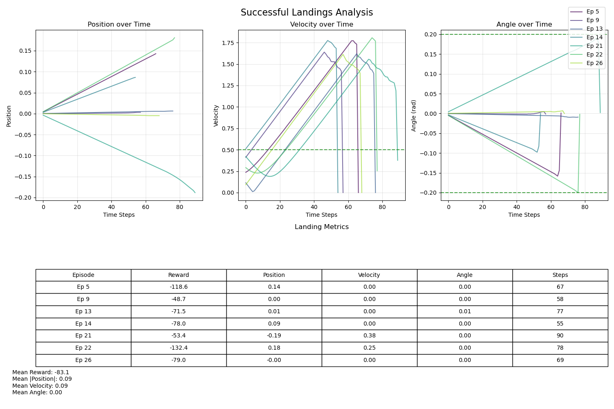
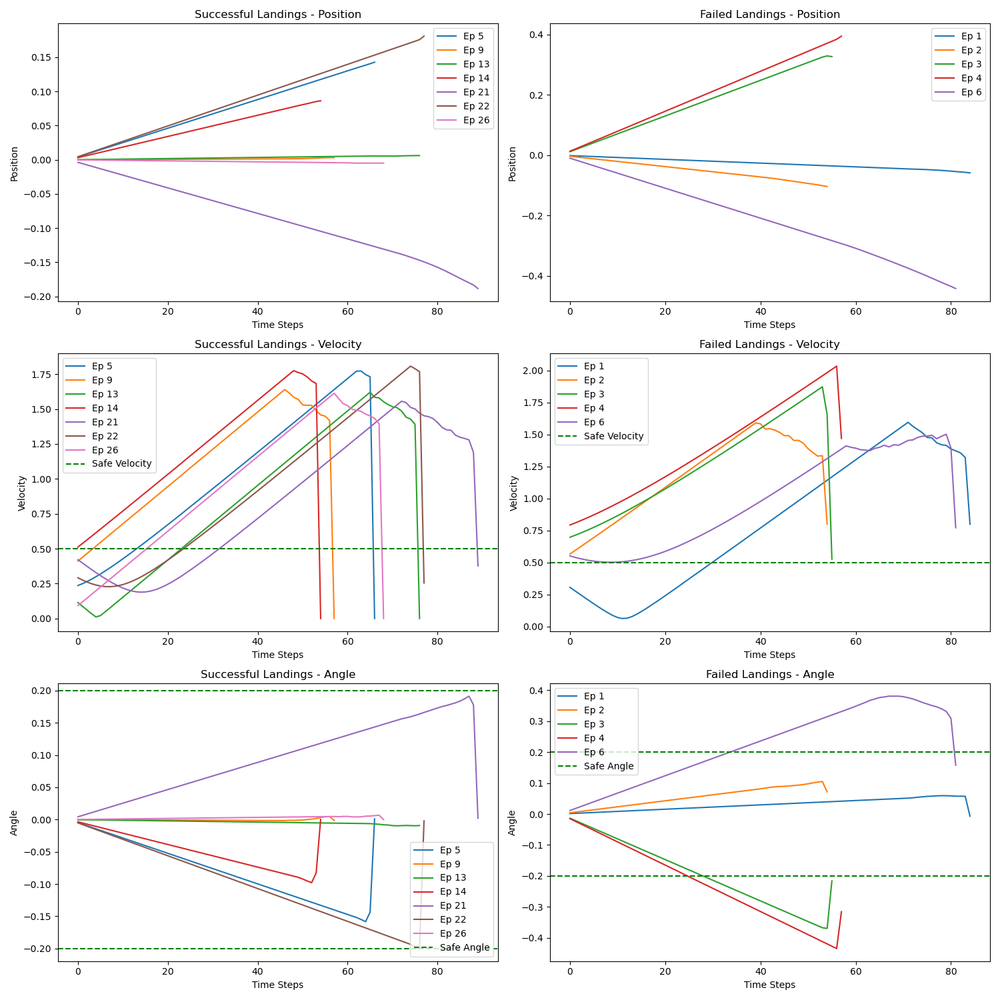

<!-- Title Slide -->
# Mastering Lunar Landing
## A Progressive Reward Shaping Approach with PPO

Kevin Mok
Michigan State University
Machine Learning Course

---

<!-- Introduction: RL & Lunar Lander Overview -->
## Reinforcement Learning for Lunar Landing

**Reinforcement Learning:**
- Trains agents through trial-and-error
- Goal: Learn policy π(a|s) to maximize rewards
- Agent receives state, takes action, gets reward

**LunarLander-v2 Challenge:**
- Physics-based simulation
- Requires precise thruster control
- Multiple objectives: accuracy, stability, efficiency

---

<!-- Implementation & Technical Details -->
## Implementation & Libraries

**Libraries & Framework:**
- **Gymnasium**: Standard environments for RL research 
  (successor to OpenAI Gym)
- **PyTorch**: Neural network implementation
- **TensorBoard**: Experiment tracking
- **NumPy/Pandas**: Data processing

**Project Components:**
- PPO agent implementation
- Custom environment wrapper
- Reward shaping configuration
- Parameter search and visual analysis

---

<!-- Environment Details -->
## The Lunar Landing Challenge

**State Space (8 dimensions):**
- Position (x, y)
- Velocity (x, y)
- Angle and angular velocity
- Leg contact indicators (2)

**Action Space (4 actions):**
- Do nothing
- Fire left thruster
- Fire main engine
- Fire right thruster

---

<!-- Success Criteria -->
## Success Criteria & Parallels

**Success Requires:**
- Landing between flags
- Low touchdown velocity (<0.5 m/s)
- Upright orientation (±0.2 rad)
- Landing on both legs

**Real-World Parallels:**
- Spacecraft landing
- Drone precision landing
- Autonomous vehicle control

---

<!-- PPO Algorithm -->
## Our Approach: Proximal Policy Optimization

**Why PPO?**
- Balances sample efficiency and stability
- Prevents destructive policy updates
- State-of-the-art in many control tasks

**PPO Architecture:**
- Actor-Critic with shared parameters
- 2 hidden layers with 64 neurons each
- ReLU activations, softmax output layer

**Key Hyperparameters:**
- Learning rate: 3e-4, Discount: γ = 0.99
- GAE: λ = 0.95, Clip: ε = 0.2

---

<!-- Baseline Comparison -->
## Initial Performance Problems

**Initial Challenges:**
- PPO agent achieves high rewards but doesn't land
- 0% landing success rate despite high rewards
- Agent optimizes for objectives that don't ensure landing

**Initial Observations:**
- Agent learns to control orientation
- Develops hover strategy instead of landing strategy
- Maximizes rewards without completing the intended task

---

<!-- Initial Problem -->
## Initial Problem: Reward Gaming

**Unexpected Agent Behavior:**
- 0% successful landings with default rewards
- Agent learned to hover indefinitely
- High rewards (~200) despite never landing

**Root Cause:**
- Cumulative survival rewards > one-time landing reward
- Crash penalty (-100) > landing reward (+100)
- Agent optimized exactly what we specified

---

<!-- Problem Description -->
## The "Hover Problem" in Detail

**Default Reward Structure:**
- Landing reward: +100 points
- Crash penalty: -100 points
- Engine usage: -0.3 points per frame (main engine)
- Position-based shaping: Small rewards/penalties
- Leg contact: +10 points per leg

**Observed Behavior:**
- Agents maintained position above landing pad
- Used minimal fuel to stay airborne
- Never attempted landing despite high rewards

---

<!-- Failed Landing Example -->
## Failed Landing Analysis

**Key Observations:** 
- No successful landing attempt
- Hovers above landing pad
- Excessive horizontal movement
- Minimizes fuel usage
- Avoids crash penalty
- Time-based advantage: longer episodes = more reward

**Risk Aversion:**
- Landing attempts risk -100 crash penalty
- Hovering provides safe, steady reward accumulation
- Mathematically optimal strategy = don't land

---

<!-- Reward Function Evolution -->
## Solution: Reward Function Redesign

**Reward Gaming Analysis:**
- Default parameters led to 0% landing success rate
- Agent "gamed" the reward system by hovering
- Risk-reward balance favored avoiding landing

**Progressive Training Approach:**
1. **Stage 1 (Implemented):** Focus solely on landing
2. **Stage 2 (Planned):** Add landing precision rewards
3. **Stage 3 (Planned):** Introduce efficiency objectives

**Key Insight:**
- Solve one problem at a time
- Add complexity only after simpler goals achieved

---

<!-- Methods: Reward Modification -->
## Stage 1: Landing Focus Modifications

**Key Parameter Changes:**
- **Landing reward scale:** Increased from 1.7 to 10.0
- **Velocity penalty scale:** Reduced from 0.3 to 0.1
- **Fuel penalty scale:** Removed completely (0.0)

**Rationale:**
- Make landing reward substantially outweigh crash risk
- Reduce penalties that discourage landing attempts
- Allow free thruster usage to encourage exploration

**Result:**
- Landing success rate improved from 0% to 26.7%

---

<!-- Parameter Search -->
## Parameter Search Results

**Grid Search Findings:**
- 20 different reward configurations tested
- Top performing trial (Trial 12):
  - Landing reward scale: 10.0
  - Velocity penalty scale: 0.1
  - Fuel penalty scale: 0.0
  - Success rate: 26.7%

**Critical Parameters:**
- Landing reward scale had the most significant impact
- Velocity penalties needed reduction but not elimination
- Fuel penalties were detrimental to initial learning

---

<!-- Visual Behavior Analysis -->
## Visual Behavior Analysis

**Top Performers (Trial 12):**
- More strategic thruster usage
- Better fuel efficiency
- Controlled descent patterns
- Maintains upright orientation
- Better horizontal control

**Failure Modes:**
- Excessive horizontal velocity (40% of failures)
- Poor orientation control (30% of failures)
- Excessive vertical velocity (20% of failures)
- Other/mixed issues (10% of failures)

---

<!-- Results Overview -->
## Results: Improvement but Challenges Remain

**Landing Success Rate:**
- Default rewards: 0% success rate
- Stage 1 (Safety focus): 26.7% success rate
- Still significant room for improvement

**Key Metrics:**
- Successful episodes: 8 out of 30 evaluation episodes
- Average reward for successful landings: ~230.0
- 1.5 million environment interactions required

---

<!-- Learning Challenges -->
## Learning Progression & Challenges

**Training Phases:**
- **Initial phase (0-500 episodes):** Basic stability
- **Middle phase (500-1500):** Landing attempts begin
- **Final phase (1500-2000):** Landing refinement

**Sample Efficiency:**
- 1.5 million environment steps to reach 26.7% success
- Suggests room for improvement in training efficiency
- Potentially through curriculum or exploration strategies

---

<!-- Lessons Learned -->
## Key Insights & Lessons

**Reward Function Design:**
- Magnitude matters as much as structure
- Significant landing reward increase (10x) was critical
- Agent optimizes exactly what we specify

**Progressive Training Strategy:**
- Solving one problem at a time is effective
- Visual behavior analysis is essential
- Reward gaming can be subtle and requires inspection

**Importance of Visualization:**
- Reward curves alone are insufficient
- Visual inspection of agent behavior is essential

---

<!-- Future Work -->
## Future Work & Extensions

**Planned Stages 2 & 3:**
- Stage 2: Landing precision improvements
- Stage 3: Fuel efficiency optimization

**Alternative Algorithms:**
- SAC and TD3+HER implementations
- Off-policy methods for improved sample efficiency 

**Future Directions:**
- Curriculum learning approaches
- Advanced exploration strategies
- Hierarchical reinforcement learning

---

<!-- Conclusion -->
## Conclusion

**Main Contributions:**
- Identified and analyzed the "hover problem"
- Improved success rate from 0% to 26.7%
- Demonstrated importance of reward magnitude and design

**Takeaways:**
- RL agents optimize exactly what we specify
- Progressive training can simplify complex tasks
- Reward shaping dramatically impacts behavior
- Visual analysis is critical to detect reward gaming

---

<!-- Thank You & Questions -->
# Thank You!

## Questions?

**Resources:**
- Full code: https://github.com/kevmok/lunar-lander-ppo
- Video demonstrations available on request
- Detailed metrics analysis in appendix

**Contact:**
Kevin Mok
mokkevi1@msu.edu 